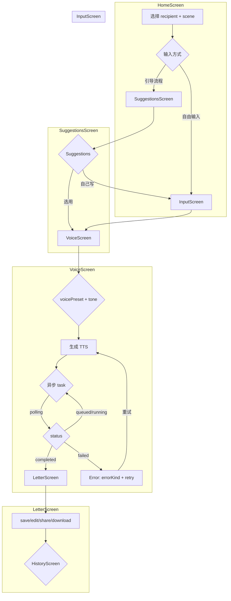

# P17 XiangTa H5 Design Alignment C8

## 1. 阶段定位

### 当前状态

- **设计稿**：`design_h5/想他了点击版本/` 包含 7 个 React 屏幕、tokens、states、components
- **初稿**：`apps/xiangta-h5/app.js` 包含 bootstrap、suggestions、TTS、letter CRUD
- **API 契约**：C5（copywriting）、C6（error contract）、C7（voicePreset→profileId 映射）已完成设计
- **当前 API**：`GET /bootstrap`、`POST /suggestions`、`POST /tts`（同步）、`POST /letters`、`GET /letters`

### C8 目标

```
C8 只做 H5 产品设计对齐审查与重构计划，不实现代码。
目标：确认设计稿与当前初稿的差距，识别需要新增的 API 契约，制定分阶段实现计划。
```

### C8 不解决

```
不修改 apps/xiangta-h5/app.js
不修改 design_h5/想他了点击版本/
不实现任何 API
不实现 task polling / debounce（CA-06）
```

---

## 2. 设计稿文件清单

### 2.1 design_h5/想他了点击版本/ 文件结构

```
design_h5/想他了点击版本/
├── tokens.jsx          # 设计 token 系统：T 对象 + 4 套 palette
├── screens.jsx          # 7 个 React 屏幕组件
├── states.jsx          # 6 个状态组件 + ComponentShowcase
├── components.jsx      # 8 个核心 UI 组件 + icons
├── index.html          # 入口 HTML
├── package.json
├── vite.config.js
└── 7-MINIMAX.fig        # Figma 源文件引用
```

### 2.2 设计技术栈

```
React 17 + JSX（不是 plain JS）
Vite 构建工具
CSS-in-JS（token 对象 + applyPalette）
设计稿使用 React 组件化，不是当前 app.js 的 IIFE 模式
```

**重要发现**：设计稿使用 React JSX 实现，当前初稿使用 plain JS IIFE。未来 H5 重构需要决定是否采用 React，或者将设计稿的视觉/交互设计移植到 plain JS。

### 2.3 设计稿 token 系统（tokens.jsx）

| Palette | 用途 | Primary | Accent |
|---|---|---|---|
| `purple`（默认） | 正式产品 | `#A855F7` | `#F0ABFC` |
| `amber` | 温暖场景 | `#F59E0B` | `#FCD34D` |
| `sage` | 平和场景 | `#6B8E23` | `#9ACD32` |
| `rose` | 浪漫场景 | `#E11D48` | `#FB7185` |

Surface：背景 `#0F0F0F` / `#1A1A1A` / `#262626`，Card `#1F1F1F`
Text：Primary `#FAFAFA`，Secondary `#A1A1AA`，Muted `#71717A`

### 2.4 设计稿 7 屏幕概览（screens.jsx）

| Screen | 用途 | 关键交互 |
|---|---|---|
| `HomeScreen` | 入口：recipient + scene 选择 | 4 recipient cards → scene chips → generate suggestions |
| `InputScreen` | 自由输入文案 | textarea + recipient + scene chips |
| `SuggestionsScreen` | 文案推荐列表 | 点击选用 → VoiceScreen |
| `VoiceScreen` | 声线 + 语气选择 | voicePresetSelect + toneSelect → TTS → LetterScreen |
| `LetterScreen` | 信件编辑 + 播放 | save/edit/share/download + 音频播放 |
| `HistoryScreen` | 历史信件列表 | list + detail |
| `SettingsScreen` | 设置 | 额度查询、语言设置等 |

### 2.5 设计稿状态组件（states.jsx）

| State | 类型 | 触发 |
|---|---|---|
| `StateGenerating` | loading | 正在生成文案/语音 |
| `StateQuota` | empty | 额度不足 |
| `StateNoProvider` | error | Provider 不可用 |
| `StateFailed` | error | 生成失败 |
| `StateEmpty` | empty | 无数据 |
| `StateSavedToast` | success | 保存成功 |
| `ComponentShowcase` | dev | 组件展示模式 |

---

## 3. 当前 H5 初稿分析

### 3.1 app.js 结构（apps/xiangta-h5/app.js）

| 函数 | 功能 | 对应设计稿 |
|---|---|---|
| `loadBootstrap()` | 加载 bootstrap → 填充 voicePresetSelect | VoiceScreen voicePreset |
| `loadCoreProfiles()` | 加载 /core/profiles → 填充 coreProfileSelect | VoiceScreen profileIdSelect（dev only） |
| `generateTts()` | POST /tts 同步 → 播放音频 | VoiceScreen TTS → LetterScreen |
| `renderSuggestions()` | 渲染 suggestion cards | SuggestionsScreen |
| `renderTtsResult()` | 渲染 audio player | LetterScreen mini player |
| `saveLetter()` / `loadLetters()` | letter CRUD | LetterScreen |
| `escHtml()` | XSS 防护 | 通用 |

**当前问题**：
- TTS 是同步调用（`POST /tts`），设计稿预期异步 task 模式
- 无 task polling（`GET /tts/tasks/{id}`）
- 同时发送 `voicePreset` 和 `profileId`（B9 smoke path）
- 无 debounce 保护（CA-06）
- 无 scene/recipient 驱动建议流程

### 3.2 当前 API 依赖

```
GET  /api/xiangta/bootstrap              → voicePresets + tonePresets
GET  /api/xiangta/core/profiles          → Core profiles（dev only）
POST /api/xiangta/suggestions            → 文案建议
POST /api/xiangta/tts                    → 同步 TTS
POST /api/xiangta/letters                → 保存信件
GET  /api/xiangta/letters                → 历史信件
```

### 3.3 与设计稿的流程差距

```
当前初稿：
  Home → Input（直接自由输入）→ Suggestions → Voice → Letter

设计稿：
  Home（recipient + scene 选择）→ Input（可选）→ Suggestions → Voice → Letter
```

设计稿有 recipient + scene 驱动的引导流程，当前初稿是纯自由输入。

---

## 4. C5/C6/C7 API 契约与 H5 对齐

### 4.1 C7 voicePreset 唯一入口

C7 设计：`GET /api/xiangta/voice-presets` 返回公共 voicePreset（不含 coreProfileId）。

| API | H5 用途 | C7 设计 |
|---|---|---|
| `GET /voice-presets` | H5 声线选择 | ✅ 新增，返回 id/label/desc/scenes/recipients/defaultTone，无 coreProfileId |
| `GET /bootstrap` | H5 初始化 | 继续使用，返回 voicePresets + tonePresets |
| `GET /core/profiles` | Dev panel | 保留，仅 dev mode |

**H5 适配**：voicePresetSelect 数据源从 `bootstrap.voicePresets` 切换到 `GET /voice-presets`。

### 4.2 C6 errorKind 与 H5 展示

C6 定义 13 个 H5 错误展示类别：

| errorKind | H5 展示方式 | H5 当前处理 |
|---|---|---|
| `validation_error` | 表单下方红色提示 | ❌ 未处理（依赖 HTTP 400） |
| `core_unavailable` | 错误卡片+重试按钮 | ⚠️ 显示 alert |
| `provider_error` | 错误卡片+重试按钮 | ⚠️ 显示 alert |
| `tts_timeout` | 错误卡片+重试按钮 | ❌ 未区分 |
| `provider_quota` | 温和提示 | ❌ 未处理 |
| `queue_full` | 温和提示 | ❌ 未处理 |
| `rate_limited` | 温和提示 | ❌ 未处理 |
| `copywriting_blocked` | 文案区温和提示 | ❌ 未处理 |
| `copywriting_fallback` | 不打扰（dev 模式 badge） | ❌ 未处理 |
| `storage_write_failed` | Toast | ❌ 未处理 |
| `no_provider` | 错误卡片+重试 | ⚠️ 显示 alert |
| `task_not_found` | 提示+返回 | ❌ 不适用（当前同步） |
| `unknown` | 通用错误提示 | ⚠️ 显示 alert |

### 4.3 C5 Copywriting 与 H5

C5 设计的 `suggestions` 响应：
```json
{
  "ok": true,
  "data": {
    "summary": "表达想念与牵挂",
    "intent": "miss",
    "suggestions": ["我想你了，想见你", "..."],
    "source": "llm",
    "fallbackUsed": false,
    "charCount": 50
  }
}
```

**H5 当前处理**：`renderSuggestions()` 直接渲染 suggestions 数组，无 summary/intent/source/fallbackUsed 展示。

**H5 需要的展示**：
- summary：用户可理解的意图描述
- source badge（dev 模式）：区分 "AI 生成" vs "模板"
- fallbackUsed badge（dev 模式）：表示使用了模板 fallback

---

## 5. 正式 H5 vs Dev/Smoke UI 边界

### 5.1 正式 H5 UI

| 区域 | 内容 |
|---|---|
| 声线选择 | `GET /voice-presets` → voicePresetSelect（只有 voicePreset，无 profileId） |
| 语气选择 | `GET /bootstrap` → tonePresets |
| 场景/对象 | Scene chips + Recipient cards（引导流程） |
| 文案区 | Suggestions + Input textarea |
| 结果区 | LetterScreen 音频播放 + 信件操作 |

### 5.2 Dev Panel UI

| 区域 | 内容 | 条件 |
|---|---|---|
| profileId 选择 | `GET /core/profiles` → coreProfileSelect | dev mode only |
| Admin mapping | `GET /admin/voice-mappings` | adminEnabled + token |
| Debug info | requestId / taskId 显示 | dev mode only |

### 5.3 边界决策

```
正式 H5：
  ❌ 不显示 coreProfileSelect
  ❌ 不调用 /core/profiles
  ❌ 不显示 profileId

Dev/Smoke H5：
  ✅ coreProfileSelect（带"仅开发模式"标识）
  ✅ /core/profiles 调用
  ✅ 显示 profileId（仅在 dev mode）
```

---

## 6. H5 用户流程

### 6.1 完整用户流程

```
1. HomeScreen
   └─ 选择 recipient（lover/self/family/friend）
   └─ 选择 scene（miss/comfort/thanks/sorry/encourage）
   └─ 点击"获取建议" → SuggestionsScreen

2. SuggestionsScreen
   └─ 展示 AI 文案建议（summary + suggestions）
   └─ 点击选用 → VoiceScreen
   └─ 或点击"自己写" → InputScreen

3. InputScreen（可选）
   └─ textarea 自由输入
   └─ recipient + scene 已预填
   └─ 点击"生成语音" → VoiceScreen

4. VoiceScreen
   └─ 选择 voicePreset（来自 GET /voice-presets）
   └─ 选择 tone（来自 bootstrap）
   └─ 点击"生成语音" → POST /tts（未来 → POST /tts/tasks）
   └─ 生成完成 → LetterScreen

5. LetterScreen
   └─ 播放音频
   └─ 编辑信件内容
   └─ 保存 / 分享 / 下载
   └─ 查看历史 → HistoryScreen
```

### 6.2 异步 TTS 流程（目标）

```
VoiceScreen 点击生成
  └─ POST /tts/tasks {text, voicePreset, tone, recipient, scene}
     └─ 返回 {taskId: "T_xxx", status: "queued"}
  └─ 显示 generating 状态
  └─ 轮询 GET /tts/tasks/{taskId}
     └─ status=completed → audioUrl → LetterScreen
     └─ status=failed → errorKind → 错误卡片
     └─ status=queued/running → 继续轮询
```

---

## 7. H5 Page 状态机

### 7.1 状态定义

```
states:
  - screen: HomeScreen | InputScreen | SuggestionsScreen | VoiceScreen | LetterScreen | HistoryScreen | SettingsScreen
  - flow: guided | free
  - generating: null | "suggestions" | "tts"
  - ttsTaskId: null | string
  - ttsResult: null | TtsData
  - suggestions: null | SuggestionsData
  - letters: Letter[]
  - error: null | ErrorData
  - devMode: boolean
```

### 7.2 状态机图



---

## 8. 组件拆分计划

### 8.1 React 组件（设计稿）

```
screens.jsx:
  HomeScreen        # recipient + scene 选择
  InputScreen       # textarea 自由输入
  SuggestionsScreen # 文案建议列表
  VoiceScreen       # voicePreset + tone + TTS
  LetterScreen      # 信件编辑 + 音频播放
  HistoryScreen     # 历史信件列表
  SettingsScreen    # 设置

states.jsx:
  StateGenerating   # loading 状态
  StateQuota        # 额度不足
  StateNoProvider   # Provider 不可用
  StateFailed       # 生成失败
  StateEmpty        # 空状态
  StateSavedToast   # 保存成功 toast

components.jsx:
  RecipientCard     # 对象选择卡片
  SceneChip         # 场景标签
  MiniPlayer        # 迷你音频播放器
  FullPlayer        # 完整音频播放器（含波形）
  ExpressionCard    # 文案建议卡片
  AppBar            # 顶部导航
  StepDots          # 步骤指示
  StatusPill        # 状态徽标
  LetterSeal        # 信件印章
  Dot               # 加载点动画
  I                 # 图标对象
```

### 8.2 Plain JS 迁移方案（如果保留 app.js）

如果 H5 继续使用 plain JS（不引入 React），需要将设计稿的交互设计移植到 app.js：

```
app.js 模块化拆分（plain JS IIFE）：
  - state management（状态机）
  - api calls（API 封装）
  - rendering（各 screen/component render 函数）
  - event handlers（用户交互）
```

**设计稿的 React JSX 不能直接用于 plain JS**，需要重写 render 函数。

### 8.3 推荐方案

```
短期（当前 app.js）：
  1. 保持 plain JS IIFE 架构
  2. 新增 screen-based render 函数
  3. 复用设计稿的 token 系统（CSS variables）

长期（C12 React 重构）：
  1. 迁移到 React + Vite
  2. 使用设计稿的 JSX 组件
  3. 接入设计稿的 token 系统
```

---

## 9. C5 适配需求

### 9.1 SuggestionsData 完整字段

```typescript
interface SuggestionsData {
  summary: string;       // "表达想念与牵挂"
  intent: string;        // "miss"
  suggestions: string[]; // ["我想你了...", "..."]
  source: "llm" | "template";
  fallbackUsed: boolean;
  charCount: number;    // 后端计算
}
```

### 9.2 H5 渲染需求

| 字段 | 渲染位置 | 方式 |
|---|---|---|
| `summary` | SuggestionsScreen 顶部 | 大字展示 |
| `suggestions` | SuggestionsScreen 列表 | 点击填充 VoiceScreen |
| `source` | dev 模式 badge | "AI 生成" / "模板" |
| `fallbackUsed` | dev 模式 badge | 当 source=template 时显示 |
| `charCount` | InputScreen textarea 下方 | 实时字数统计 |

### 9.3 Copywriting 错误展示

| errorKind | 展示 |
|---|---|
| `copywriting_blocked` | "这段内容暂时不适合生成文案，请换一种表达。" |
| `copywriting_timeout` | fallback to template，用户无感知（dev 模式显示 badge） |
| `copywriting_provider_error` | fallback to template，用户无感知 |
| `copywriting_invalid_output` | fallback to template，用户无感知 |

---

## 10. C6 适配需求

### 10.1 normalizeError H5 adapter

C6 设计的 `normalizeError()` helper（H5 需要实现）：

```javascript
function normalizeError(response) {
  // 兼容平铺和嵌套结构
  if (response.error) {
    return {
      ok: false,
      errorKind: response.error.errorKind,
      message: response.error.message,
      retryable: response.error.retryable,
      requestId: response.error.requestId || null,
      taskId: response.error.taskId || null,
    };
  }
  // 兼容旧平铺结构
  return {
    ok: response.ok,
    errorKind: response.errorKind,
    message: response.message,
    retryable: response.retryable,
    requestId: null,
    taskId: null,
  };
}
```

### 10.2 错误展示组件映射

| errorKind | 展示组件 | retryable |
|---|---|---|
| `validation_error` | 表单内红色提示 | ❌ |
| `core_unavailable` | StateNoProvider + 重试按钮 | ✅ |
| `provider_error` | StateFailed + 重试按钮 | ✅ |
| `tts_timeout` | StateFailed + 重试按钮 | ✅ |
| `provider_quota` | StateQuota（温和提示） | ❌ |
| `queue_full` | StateQuota（温和提示） | ✅ |
| `rate_limited` | StateQuota（温和提示） | ✅ |
| `copywriting_blocked` | StateFailed + 文案提示 | ❌ |
| `storage_write_failed` | StateSavedToast（保存失败） | ❌ |
| `no_provider` | StateNoProvider + 重试 | ✅ |
| `unknown` | StateFailed + 通用提示 | ✅ |

### 10.3 requestId / taskId 展示（dev mode）

```
dev mode 时：
  - 显示 requestId（X-Request-Id header）
  - 显示 taskId（异步 TTS 时）
  - 用于调试和日志关联
```

---

## 11. C7 适配需求

### 11.1 voice-presets API H5 适配

`GET /api/xiangta/voice-presets`（C7 设计）：

```json
{
  "ok": true,
  "data": {
    "presets": [
      {
        "id": "night-male",
        "label": "深夜男声",
        "desc": "低沉、克制，适合深夜想念和独白",
        "recommendedScenes": ["miss", "night"],
        "suitableRecipients": ["lover", "self"],
        "defaultTone": "gentle",
        "enabled": true
      }
    ],
    "total": 1,
    "source": "config"
  }
}
```

**H5 渲染**：voicePresetSelect 显示 `label` + `recommendedScenes hint`。

### 11.2 TTS 请求变化

当前 B9 H5：
```json
POST /api/xiangta/tts
{
  "text": "我想你了",
  "voicePreset": "night-male",
  "profileId": "deep_night_programmer",  // ❌ 不应与 voicePreset 同时出现
  "tone": "gentle",
  "recipient": "lover",
  "scene": "miss"
}
```

C7 目标 H5：
```json
POST /api/xiangta/tts
{
  "text": "我想你了",
  "voicePreset": "night-male",
  "tone": "gentle",
  "recipient": "lover",
  "scene": "miss"
}
```

**注意**：`profileId` 不再允许与 `voicePreset` 同时出现。Dev/smoke path 保留独立 `profileId` 字段。

### 11.3 Dev Panel profileId

Dev panel 保留 `GET /core/profiles` 调用，但：
- 显示"仅开发模式"标识
- 不作为正式 H5 UI

---

## 12. CA-06 Debounce / 并发保护

### 12.1 问题

CA-06：H5 无防重复点击保护，用户快速多次点击会触发多个 TTS 请求。

### 12.2 H5 保护措施

```
H5 实现需求：
  1. 操作按钮点击后立即 disable（generateTts, saveLetter）
  2. 请求返回前按钮保持 disable
  3. 请求返回后恢复按钮状态
  4. 异步 TTS polling 期间禁用所有操作按钮
  5. 错误返回时恢复按钮
```

### 12.3 C8 不实现

```
C8 只设计 debounce 策略，不实现。
CA-06 在 C8 实现阶段处理。
```

---

## 13. 错误 UX 设计

### 13.1 8 类错误 UX

| 错误类型 | 触发场景 | H5 行为 |
|---|---|---|
| **网络不可达** | Core 服务宕机 | StateNoProvider + "语音服务暂时连接不上，请稍后再试。" + 重试按钮 |
| **Provider 错误** | Provider 返回异常 | StateFailed + "语音生成失败了，可以再试一次。" + 重试按钮 |
| **超时** | TTS 生成超时 | StateFailed + "语音生成超时了，请稍后再试。" + 重试按钮 |
| **额度不足** | provider_quota | StateQuota + "当前语音额度暂时不可用，请稍后再试。" |
| **队列满** | queue_full | StateQuota + "当前生成任务较多，请稍后再试。" |
| **文案拦截** | copywriting_blocked | 文案区温和提示 + "这段内容暂时不适合生成文案，请换一种表达。" |
| **保存失败** | storage_write_failed | Toast + "保存失败，但音频已生成。" |
| **未知错误** | unknown | StateFailed + "出了点小问题，可以再试一次。" + 重试按钮 |

### 13.2 重试 UX

```
retryable=true 时：
  1. 显示错误卡片
  2. 显示"重试"按钮
  3. 按钮点击 → 重新发起请求
  4. 轮询时出错 → 停止轮询，显示错误

retryable=false 时：
  1. 显示错误文案
  2. 不显示重试按钮
  3. 引导用户修正输入或联系支持
```

---

## 14. 实现阶段拆分

### 14.1 阶段总览

| 阶段 | 任务 | 类型 | 依赖 |
|---|---|---|---|
| C8 | H5 Design Alignment | **Design（当前）** | C6 ✅, C7 ✅ |
| C8-1 | H5 screen/component 结构 | Implementation | C8 ✅ |
| C8-2 | H5 normalizeError adapter | Implementation | C6 ✅ |
| C8-3 | H5 error UX（8 类） | Implementation | C6, C8-2 |
| C8-4 | H5 async TTS task flow | Implementation | C10 |
| C8-5 | H5 dev panel profileId | Implementation | C7-1 |
| C8-6 | H5 debounce/concurrency | Implementation | C8-1 |
| C9 | Storage Foundation | Implementation | C6-1 ✅ |
| C10 | TTS Task MVP | Implementation | C9 |
| C11 | LLM Copywriting MVP | Implementation | C9, C10 |
| C12 | H5 React 重构（如采用） | Implementation | C11 |

### 14.2 C8-1 H5 screen/component 结构

```
目标：
  1. 将 app.js 拆分为 screen-based render 函数
  2. 实现 7 个 screen 的基本切换
  3. 使用设计稿的 token 系统（CSS variables）

输出：
  - app.js 保持 plain JS IIFE
  - 新增 screen render 函数（HomeScreen, VoiceScreen 等）
  - CSS variables 对应设计稿 tokens
```

### 14.3 C8-2 H5 normalizeError adapter

```
目标：
  1. 实现 normalizeError() helper
  2. 所有 API 响应通过 normalizeError 处理
  3. 兼容平铺和嵌套 error 结构

输出：
  - normalizeError 函数
  - 统一 errorKind 解析
```

### 14.4 C8-3 H5 error UX

```
目标：
  1. 实现 8 类错误的 H5 展示
  2. 使用 states.jsx 中的状态组件
  3. retryable 错误显示重试按钮

输出：
  - StateGenerating / StateFailed / StateQuota 等
  - 错误文案本地化
  - 重试逻辑
```

### 14.5 C8-4 H5 async TTS task flow

```
目标：
  1. POST /tts/tasks 创建异步 task
  2. GET /tts/tasks/{id} polling
  3. status=completed → 播放音频
  4. status=failed → 错误展示

依赖：C10 TTS Task MVP
输出：完整的异步 TTS 用户流程
```

### 14.6 C8-5 H5 dev panel profileId

```
目标：
  1. dev mode 显示 coreProfileSelect
  2. 非 dev mode 隐藏 profileId
  3. profileId 与 voicePreset 二选一

依赖：C7-1 voicePreset resolution
输出：dev panel UI
```

### 14.7 C8-6 H5 debounce/concurrency

```
目标：
  1. 操作按钮防重复点击
  2. 异步操作期间禁用按钮
  3. 并发保护

输出：CA-06 修复
```

---

## 15. 测试设计建议

### 15.1 H5 E2E 测试场景

```
test_h5_suggestions_flow:
  1. 选择 recipient + scene
  2. 获取建议
  3. 选用建议 → VoiceScreen

test_h5_tts_generation:
  1. 选择 voicePreset + tone
  2. 生成 TTS
  3. 播放音频

test_h5_error_core_unavailable:
  1. Mock Core unavailable
  2. 生成 TTS
  3. 显示 StateNoProvider + 重试

test_h5_debounce:
  1. 快速点击生成按钮多次
  2. 验证只发起一次请求

test_h5_dev_panel:
  1. dev mode 时显示 profileId
  2. 非 dev mode 时隐藏 profileId
```

### 15.2 Mock 策略

```
H5 E2E 必须 mock 高消费接口：
  - POST /tts → mock success audioUrl
  - POST /tts/tasks → mock taskId
  - GET /tts/tasks/{id} → mock polling states
  - POST /suggestions → mock suggestions
  - GET /bootstrap → mock bootstrap data
  - GET /voice-presets → mock presets（不含 coreProfileId）
  - GET /core/profiles → mock profiles（dev only）
```

### 15.3 测试文件位置

```
tests/e2e/
  test_h5_suggestions_flow.py
  test_h5_tts_generation.py
  test_h5_error_cases.py
  test_h5_debounce.py
  test_h5_dev_panel.py
```

---

## 16. 优先级表

| ID | 任务 | 优先级 | 原因 |
|---|---|---|---|
| C8-1 | H5 screen/component 结构 | **P0** | 基础 UI 框架 |
| C8-2 | H5 normalizeError adapter | **P0** | 错误处理基础 |
| C8-3 | H5 error UX（8 类） | **P0** | 用户体验保障 |
| C8-4 | H5 async TTS task flow | **P1** | 异步 TTS 核心流程 |
| C8-5 | H5 dev panel profileId | **P1** | dev/smoke 能力 |
| C8-6 | H5 debounce/concurrency | **P2** | CA-06，UX 优化 |
| C12 | H5 React 重构 | **P2** | 未来可选方向 |

---

## 17. 设计稿与初稿差距总结

### 17.1 功能差距

| 功能 | 设计稿 | 当前初稿 | 差距 |
|---|---|---|---|
| recipient + scene 引导 | ✅ HomeScreen | ❌ 直接自由输入 | 缺失引导流程 |
| voicePreset 选择 | ✅ voicePresetSelect | ⚠️ 有但与 profileId 混用 | C7 适配后修复 |
| 异步 TTS | ✅ task polling | ❌ 同步 POST /tts | C8-4 实现 |
| suggestions 展示 | ✅ summary + source | ❌ 只有列表 | 缺失 summary/intent |
| error 展示 | ✅ 8 类状态组件 | ⚠️ alert 简单处理 | C8-3 系统化 |
| 音频播放器 | ✅ waveform | ❌ 简单 audio | 设计稿更丰富 |
| debounce | ✅ 按钮保护 | ❌ 无 | C8-6 实现 |

### 17.2 技术栈差距

| 方面 | 设计稿 | 当前初稿 | 说明 |
|---|---|---|---|
| 框架 | React + JSX | Plain JS IIFE | 架构选择 |
| 构建 | Vite | 无（直接 HTML 加载） | 是否引入构建 |
| 组件化 | React 组件 | 函数模块 | 重构工作量 |
| 状态管理 | React state/context | 裸 state 对象 | 重构工作量 |

---

## 18. 交叉引用

- **C5 Copywriting LLM Design**：suggestions API 契约，source/fallbackUsed 字段
- **C6 Backend Error Contract**：errorKind 枚举，retryable 语义，normalizeError helper
- **C7 Profile Mapping Design**：voicePreset 唯一入口，coreProfileId 对 H5 不可见
- **CA-06**：H5 debounce 保护（deferred to C8-6）
- **C9 Storage Foundation**：letter CRUD 持久化
- **C10 TTS Task MVP**：异步 task API
- **C11 LLM Copywriting MVP**：copywriting API

---

## 19. 关键设计决策总结

| 决策 | 选择 | 原因 |
|---|---|---|
| H5 继续用 plain JS | ✅ 短期 | 保持当前架构，先跑通流程 |
| 设计稿 token 复用 | ✅ | CSS variables 兼容 plain JS |
| normalizeError H5 adapter | ✅ | C6 设计的 helper |
| error UX 用 states.jsx | ✅ | 设计稿已有状态组件 |
| async TTS polling | ✅ | 设计稿预期异步流程 |
| dev panel profileId | ✅ | C7 设计的 dev/smoke 边界 |
| C8-1 → C8-6 顺序 | ✅ | 基础先行，async 最后 |
