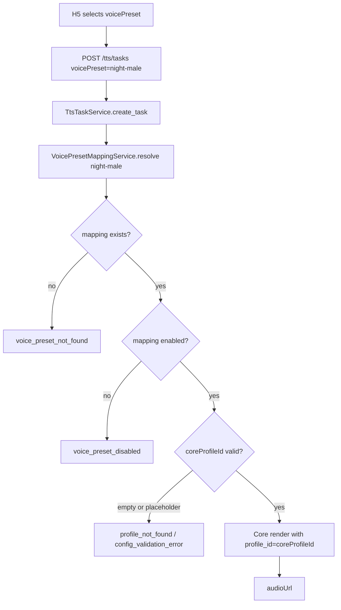

# P17 XiangTa Profile Mapping Design C7

## 1. 阶段定位

### 当前状态

B9 链路已验证：XiangTa → Core profiles → Core render → audioUrl → H5 播放。

B9 使用的是 **smoke path**：
- H5 调用 `GET /api/xiangta/core/profiles` 获取 Core profiles
- H5 直接展示 Core profileId 供用户选择
- TTS 请求同时发送 `voicePreset`（来自 bootstrap）和 `profileId`（来自 /core/profiles）
- `profileId` 优先，`voicePreset` mapping 被绕过

### C7 目标

```
C7 只设计 voicePreset → coreProfileId 产品化映射方案，不实现代码。
普通 H5 用户不再直接看到 coreProfileId。
voicePreset 作为面向用户的产品声线语义。
Admin / Dev 可以查看 Core profiles 并配置映射。
XiangTa 仍只通过 Core HTTP API 获取 profiles，不 import Core 内部模块。
```

### C7 不解决

```
不实现代码
不修改 voice_mappings.json / voice_presets.json
不迁移 JSON 到 DB
不实现 Admin 鉴权
```

---

## 2. 当前问题分析

### 2.1 H5 直接展示 Core profileId

当前 `app.js`：
```javascript
// 加载 Core profiles
const res = await apiFetch("/api/xiangta/core/profiles");
renderCoreProfileSelect(res.data);  // 渲染 Core profile 下拉框

// TTS 请求同时发送 voicePreset 和 profileId
const voicePreset = el("voicePresetSelect").value;  // bootstrap voicePresets
const profileId   = el("coreProfileSelect").value;  // 来自 /core/profiles
```

问题：
- Core profile `id` 可能是 `deep_night_programmer`，产品语义弱
- Core profile `name` 可能有测试语义
- 普通用户无法理解"应该选哪个 profile"

### 2.2 voice_mappings.json 占位符

```json
{
  "id": "female-gentle",
  "coreProfileId": "<core_profile_id_from_core_profiles>",  // 占位符
  "notes": "coreProfileId must be selected from Core GET /api/voice/profiles"
}
```

GAP-B2-001 已登记。4 个 voice mapping 全部为占位符，无法用于真实 TTS。

### 2.3 双重声线选择困惑

当前 H5 需要用户选择两次：
1. 选择 voicePreset（来自 bootstrap）
2. 选择 Core profile（来自 /core/profiles）

这两个选择没有明确关联，用户困惑。

### 2.4 B9 profileId path 优先

TtsOrchestrator 中 `profile_id` 直接路径优先于 voicePreset mapping：

```python
if profile_id:
    # 情况 A：直接使用 profileId，跳过 voicePreset → coreProfileId 映射
    ...
else:
    # 情况 B：使用 voicePreset → VoicePresetMappingService.resolve()
```

这意味着 B9 H5 完全绕过了 voicePreset mapping。

### 2.5 错误边界不清

C6 定义的错误与当前 mapping 状态不对应：
- `voice_preset_not_found`：当前 TtsOrchestrator 会走 B9 profileId path，不会触发
- `voice_preset_disabled`：当前 service 不检查 enabled
- `profile_not_found`：当前 mapping 全是占位符，Core render 会失败

---

## 3. 产品目标

### 3.1 voicePreset 作为唯一产品声线入口

```
普通 H5 用户只看到 voicePreset。
voicePreset 是产品语义："深夜男声"、"温柔陪伴声"、"克制女声"。
coreProfileId 是内部实现细节，Admin/Dev 可见，普通 H5 不可见。
```

### 3.2 示例产品声线

| voicePreset id | label | desc | 绑定 Core profile |
|---|---|---|---|
| `night-male` | 深夜男声 | 低沉、克制，适合深夜想念和独白 | `deep_night_programmer` |
| `gentle-female` | 温柔陪伴声 | 清晰、温柔，适合想念和晚安 | `soft_evening_companion` |
| `bright-female` | 明亮女声 | 轻快、年轻，适合感谢和轻快表达 | `morning_light_girl` |
| `warm-male` | 温暖稳重声 | 低沉、适合道歉和认真表达 | `steady_warm_male` |
| `comfort-voice` | 安慰型声音 | 陪伴感强，适合安慰和鼓励 | `gentle_supporter` |

### 3.3 声线服务于对象+场景+情绪

```
lover + miss + night  → 深夜男声 / 温柔陪伴声
self + comfort         → 安慰型声音
family + thanks        → 温暖稳重声
friend + sorry         → 克制女声 / 温柔陪伴声
```

### 3.4 Core profile 是 Dev/Admin 概念

```
GET /api/xiangta/core/profiles：Dev/Admin 查看，不要作为普通 H5 主要入口
正式 H5 用 voicePresetSelect，只显示 voicePreset label/desc
Dev panel 可以保留 profileId 下拉框（带"dev only"标识）
```

---

## 4. 概念模型

### 4.1 Core Profile

来源：`GET /api/voice/profiles`（Core HTTP API）

```
{
  "id": "deep_night_programmer",
  "name": "深夜程序员",
  "description": "低沉、克制的男声",
  "genderStyle": "male",
  "toneStyle": "restrained",
  ...
}
```

特点：
- Core 管理，XiangTa 只读
- XiangTa 不能修改
- 包含 `id` / `name` / `description` / `genderStyle` / `toneStyle` 等字段
- filtered：不含 `api_key` / `binding_id` / `params_json` / `provider_voice_id`

普通 H5：不可见（由 H5 内部 dev panel 保留）
Admin/Dev：可通过 `/api/xiangta/core/profiles` 查看

### 4.2 Voice Preset

来源：XiangTa 产品配置（JSON → 未来 DB）

```json
{
  "id": "night-male",
  "label": "深夜男声",
  "desc": "低沉、克制，适合深夜想念和独白",
  "coreProfileId": "deep_night_programmer",
  "enabled": true,
  "sortOrder": 10,
  "recommendedScenes": ["miss", "night", "comfort"],
  "suitableRecipients": ["lover", "self"],
  "defaultTone": "gentle",
  "providerPolicy": "core_default",
  "renderOverrides": {},
  "notes": ""
}
```

特点：
- 面向用户的声线语义
- 通过 `coreProfileId` 绑定 Core profile
- `label` / `desc` 用户可读

普通 H5：可见（通过 `/api/xiangta/voice-presets`）
Admin：可见+可写

### 4.3 Voice Mapping

定义：`voicePresetId → coreProfileId`

作用：把产品语义声线映射到底层 Core profile

当前问题：
- 4 个 mapping 全部是占位符
- 需要 Admin 配置真实 `coreProfileId`

### 4.4 Tone Preset

定义：语气/风格修饰参数

```
voicePreset 决定"谁的声音"
tonePreset 决定"怎么说"
```

两者是正交维度，可以自由组合。

---

## 5. 数据模型

### 5.1 推荐 voicePreset JSON 结构

```json
{
  "id": "night-male",
  "label": "深夜男声",
  "desc": "低沉、克制，适合深夜想念和独白",
  "coreProfileId": "deep_night_programmer",
  "enabled": true,
  "sortOrder": 10,
  "recommendedScenes": ["miss", "night", "comfort"],
  "suitableRecipients": ["lover", "self"],
  "defaultTone": "gentle",
  "providerPolicy": "core_default",
  "renderOverrides": {},
  "notes": "B9 smoke 完成后的真实映射"
}
```

### 5.2 字段约束

| 字段 | 约束 | 说明 |
|---|---|---|
| `id` | `^[a-z0-9][a-z0-9-]{1,63}$` | 稳定，不可中文/空格 |
| `label` | 1-30 字符 | H5 展示 |
| `desc` | 0-120 字符 | H5 展示 |
| `coreProfileId` | 非空，不含 `<>` 占位符 | 必须是真实 Core profile id |
| `enabled` | bool | 禁用时 H5 不展示 |
| `sortOrder` | int >= 0 | 展示排序 |
| `recommendedScenes` | 存在于 `scenes.json` | 推荐场景 |
| `suitableRecipients` | 存在于 `recipients.json` | 推荐对象 |
| `defaultTone` | 存在于 `tone_presets.json` | 默认语气 |
| `providerPolicy` | `core_default` | MVP 固定，v2 可扩展 |
| `renderOverrides` | 白名单字段 | 短期 `{}`，不得含 api_key/provider secret |
| `notes` | 0-500 字符 | Admin 备注 |

### 5.3 与 C3 voice_preset_mappings 表对齐

C3 设计的 `voice_preset_mappings` 表：

```sql
CREATE TABLE voice_preset_mappings (
    id TEXT PRIMARY KEY,
    label TEXT NOT NULL,
    "desc" TEXT,
    core_profile_id TEXT NOT NULL,
    enabled BOOLEAN NOT NULL DEFAULT TRUE,
    sort_order INTEGER NOT NULL DEFAULT 0,
    recommended_scenes TEXT,  -- JSON array
    suitable_recipients TEXT, -- JSON array
    default_tone TEXT,
    provider_policy TEXT,
    render_overrides TEXT,    -- JSON object
    notes TEXT,
    created_at TEXT NOT NULL,
    updated_at TEXT NOT NULL,
    deleted_at TEXT
);
```

**C7 设计与 C3 一致**：
- JSON 配置是 Phase 1（当前）
- DB `voice_preset_mappings` 是 Phase 2（C9 之后）

### 5.4 coreProfileId 占位符处理

```
现状：4 个 voice mapping 全部是 "<core_profile_id_from_core_profiles>"
C7 implementation：迁移时遇到占位符 → 标记 disabled 或跳过
不应将占位符写入 DB
```

---

## 6. API Contract 设计

### 6.1 普通 H5 voice-presets API

**新增**（C7 不实现）：

```http
GET /api/xiangta/voice-presets
```

响应：

```json
{
  "ok": true,
  "data": {
    "presets": [
      {
        "id": "night-male",
        "label": "深夜男声",
        "desc": "低沉、克制，适合深夜想念和独白",
        "recommendedScenes": ["miss", "night"],
        "suitableRecipients": ["lover", "self"],
        "defaultTone": "gentle",
        "enabled": true
      }
    ],
    "total": 1,
    "source": "config"
  }
}
```

**必须不返回**：
```
❌ coreProfileId
❌ providerPolicy
❌ renderOverrides
❌ notes
❌ Core profile raw fields
❌ binding id / provider voice id / api key / params_json
```

### 6.2 Admin voice-mappings API（已有）

```http
GET /api/xiangta/admin/voice-mappings
```

响应（已有）：

```json
{
  "ok": true,
  "data": [
    {
      "id": "night-male",
      "label": "深夜男声",
      "coreProfileId": "deep_night_programmer",
      "providerPolicy": "core_default",
      "renderOverrides": {},
      "enabled": true,
      "sortOrder": 10,
      ...
    }
  ]
}
```

Admin API **必须需要 C6 admin gate**（admin_disabled / admin_auth_required / admin_forbidden）。

### 6.3 TTS API 使用 voicePreset

**当前 B9**：
```json
{
  "text": "我想你了",
  "voicePreset": "night-male",
  "tone": "gentle",
  "recipient": "lover",
  "scene": "miss",
  "profileId": "deep_night_programmer"  // B9 smoke path
}
```

**C7 建议**（C10 实现）：

```json
{
  "text": "我想你了",
  "voicePreset": "night-male",
  "tone": "gentle",
  "recipient": "lover",
  "scene": "miss"
}
```

`profileId` 不再允许与 `voicePreset` 同时出现。

### 6.4 Dev/Smoke profileId path

保留 `profileId` 作为 dev/smoke 独立 path：

```json
{
  "text": "我想你了",
  "profileId": "deep_night_programmer"
}
```

**条件**：
- 只能单独使用 `profileId`，不能与 `voicePreset` 同时出现
- `profileId` path 仅限 dev / smoke，不作为正式 H5 UI

---

## 7. Mapping Resolution 流程

### 7.1 流程图



### 7.2 解析函数

```python
# VoicePresetMappingService.resolve()
def resolve(voice_preset_id: str) -> ProductVoiceMapping:
    mapping = self._config_repository.get_voice_mapping(voice_preset_id)
    if not mapping.enabled:
        raise VoicePresetDisabled(f"voicePreset '{voice_preset_id}' 已禁用")
    if not mapping.core_profile_id or "<" in mapping.core_profile_id:
        raise PresetMappingError(f"coreProfileId 未配置")
    return mapping
```

### 7.3 C6 errorKind 对齐

| 条件 | C6 errorKind | HTTP | retryable |
|---|---|---|---|
| mapping 不存在 | `voice_preset_not_found` | 404 | false |
| mapping disabled | `voice_preset_disabled` | 400 | false |
| coreProfileId 为空/占位符 | `config_validation_error` | 422 | false |
| coreProfileId 在 Core 不存在 | `profile_not_found` | 404 | false |
| Core render unavailable | `core_unavailable` | 503 | true |
| Core render bad response | `core_bad_response` | 502 | true |

---

## 8. TTS Task 创建时解析（策略 A）

### 8.1 推荐策略 A

**TTS task 创建时解析 voicePreset → profileId，并写入 task。**

```python
async def create_task(voice_preset, tone, text, ...):
    mapping = voice_preset_mapping_service.resolve(voice_preset)
    task = TtsTask(
        voice_preset=voice_preset,
        profile_id=mapping.core_profile_id,  # 解析后写入
        tone=tone,
        status="queued",
        ...
    )
    task_repo.save(task)
    return task
```

优点：
- 任务创建时解析，错误早发现
- task 记录 `voice_preset`（用户选择）+ `profile_id`（实际使用）
- mapping 后续改变不影响已创建任务
- 可复现

### 8.2 对比策略 B（不推荐）

**task 只记录 voicePreset，worker 执行时解析。**

问题：
- mapping 改变影响已创建任务
- 不可复现
- worker 依赖 mapping 在线状态

**推荐策略 A**。

### 8.3 与 C4 对齐

C4 task 数据：

```sql
CREATE TABLE tts_tasks (
    id TEXT PRIMARY KEY,
    voice_preset TEXT NOT NULL,
    profile_id TEXT NOT NULL,  -- C7: 解析后的 Core profile id
    ...
);
```

C7 设计与 C4 task 表的 `profile_id` 字段对应。

---

## 9. Core Profile 校验策略

### 9.1 Admin 保存时校验（MVP 可选）

```python
def update_voice_mapping(id: str, data: dict):
    if "coreProfileId" in data:
        core_id = data["coreProfileId"]
        # 调用 Core profiles API 校验
        core_profiles = await gateway.list_profiles()
        if core_id not in [p["id"] for p in core_profiles]:
            raise InvalidCoreProfileError(f"Core profile '{core_id}' 不存在")
    ...
```

优点：配置更可靠
缺点：Admin 保存时依赖 Core 在线

### 9.2 TTS 执行时兜底

```
如果 mapping.coreProfileId 在 Core 不存在
→ Core render 返回 404 或 error
→ TtsOrchestrator 捕获 → profile_not_found
```

优点：不要求 Admin 保存时 Core 在线
缺点：用户生成时才暴露配置错误

### 9.3 建议结论

```
MVP：Admin 保存时可选校验（有 Core 在线时）；TTS 执行时强兜底
正式产品：Admin 保存时强校验
```

---

## 10. H5 适配策略

### 10.1 当前 B9 H5 流程

```
loadBootstrap() → voicePresetSelect populated
loadCoreProfiles() → coreProfileSelect populated
generateTts() → 同时传 voicePreset + profileId
```

### 10.2 未来产品 H5 流程

```
loadBootstrap() → voicePresetSelect populated
loadVoicePresets() → （未来，替换 coreProfiles 加载）
generateTts() → 只传 voicePreset（profileId path 移除）
```

### 10.3 Dev Panel 保留

```
Dev 模式：
  - voicePresetSelect（正式产品入口）
  - profileIdSelect（dev only，带"仅开发模式"标识）
  - dev mode banner

正式模式：
  - voicePresetSelect（唯一声线入口）
  - 无 profileId select
  - 无 Core profiles 加载
```

### 10.4 voicePreset 展示

```
voicePresetSelect 选项格式：label + recommendedScenes hint
例如："深夜男声（适合想念、晚安）"
```

---

## 11. 与 C3 Storage 对齐

### 11.1 voice_preset_mappings 表

C3 设计的 `voice_preset_mappings` 表字段：

```sql
id, label, "desc", core_profile_id, enabled, sort_order,
recommended_scenes, suitable_recipients, default_tone,
provider_policy, render_overrides, notes,
created_at, updated_at, deleted_at
```

C7 设计：JSON Phase 1 → DB Phase 2，与 C3 一致。

### 11.2 letters 表对齐

C3 letters 表有 `voice_preset` 和 `profile_id` 字段：

```sql
CREATE TABLE letters (
    ...
    voice_preset TEXT NOT NULL,   -- 用户选择的 voicePreset id
    profile_id TEXT NOT NULL,     -- 解析后的 Core profile id
    ...
);
```

**目的**：即使未来 H5 不显示 profile_id，数据库仍保存用于审计和复现。

### 11.3 tts_tasks 表对齐

C4 task 数据包含 `voice_preset` 和 `profile_id`：

```sql
CREATE TABLE tts_tasks (
    ...
    voice_preset TEXT NOT NULL,
    profile_id TEXT NOT NULL,
    ...
);
```

C7 设计与 C4 一致。

---

## 12. 与 C5 Copywriting 对齐

### 12.1 独立性

```
Copywriting 生成文案与 voicePreset 完全独立。
voicePreset 决定音频声线。
Copywriting 决定文案内容。
两者是正交维度，可以自由组合。
```

### 12.2 H5 场景推荐

```
H5 可以根据 scene + recipient 推荐匹配的 voicePreset：
  lover + miss → night-male / gentle-female
  self + comfort → comfort-voice
  family + thanks → warm-male

但 LLM 不决定 coreProfileId。
CopywritingService 只返回文案建议，不涉及声线映射。
```

---

## 13. 与 C6 Error Contract 对齐

### 13.1 错误响应示例

**voice_preset_not_found**：
```json
{
  "ok": false,
  "error": {
    "errorKind": "voice_preset_not_found",
    "message": "选择的声音暂时不可用，请换一个声音。",
    "retryable": false,
    "requestId": "req_a1b2c3d4",
    "details": null
  }
}
```

**voice_preset_disabled**：
```json
{
  "ok": false,
  "error": {
    "errorKind": "voice_preset_disabled",
    "message": "该声音已被禁用，请换一个声音。",
    "retryable": false,
    "requestId": "req_a1b2c3d4",
    "details": null
  }
}
```

**profile_not_found**：
```json
{
  "ok": false,
  "error": {
    "errorKind": "profile_not_found",
    "message": "语音配置暂时不可用，请稍后再试。",
    "retryable": false,
    "requestId": "req_a1b2c3d4",
    "details": null
  }
}
```

### 13.2 Admin gate 错误

```
admin_disabled → features.adminEnabled=false
admin_auth_required → 无 X-XiangTa-Admin-Token header
admin_forbidden → token 错误
```

---

## 14. Admin/Dev 安全边界

### 14.1 普通 H5

```
只可访问：
  GET /bootstrap（voicePresets 列表）
  POST /suggestions
  POST /tts
  POST /letters
  GET /letters
  GET /voice-presets（未来）

不可访问：
  GET /admin/*
  GET /core/profiles（dev panel 除外）
```

### 14.2 Dev Panel

```
Dev 模式可见：
  GET /core/profiles（带"仅开发模式"提示）
  GET /admin/voice-mappings（需 admin token）

正式模式：
  无 /admin/* 入口
  无 /core/profiles 入口
```

### 14.3 features.adminEnabled

```
默认 false。
设置为 true 时：
  - Admin API 返回 admin_disabled（403）
  - 需要 XIANGTA_ADMIN_TOKEN 才能访问
```

C7 不实现 Admin gate 实现（C6-7）。

---

## 15. 数据校验规则

### 15.1 voice mapping 校验

| 字段 | 校验规则 |
|---|---|
| `id` | 必填，`^[a-z0-9][a-z0-9-]{1,63}$` |
| `label` | 必填，1-30 字符 |
| `desc` | 选填，0-120 字符 |
| `coreProfileId` | 必填，非空，不含 `<>` |
| `enabled` | bool |
| `sortOrder` | int >= 0 |
| `recommendedScenes` | 值必须在 `scenes.json` 中存在 |
| `suitableRecipients` | 值必须在 `recipients.json` 中存在 |
| `defaultTone` | 值必须在 `tone_presets.json` 中存在 |
| `providerPolicy` | 仅允许 `core_default`（MVP）；v2 可扩展 |
| `renderOverrides` | 仅白名单字段（speed/vol/pitch/emotion/audio_format/need_subtitle），不得含 api_key/provider secret |

### 15.2 renderOverrides 安全约束

```
ProductConfigWriter 已有白名单：
_RENDER_OVERRIDES_WHITELIST = {"speed", "vol", "pitch", "emotion", "audio_format", "need_subtitle"}

不得通过 renderOverrides 绕过 Provider 配置。
不得传入 api_key / provider_voice_id / binding_id / params_json。
```

---

## 16. JSON → DB Migration 策略

### 16.1 C7 Design（不迁移）

```
C7 只设计，不迁移 JSON 到 DB。
```

### 16.2 C7 Implementation / C9-4

```
1. 读取 voice_mappings.json
2. 校验每个 mapping：
   - id / label 非空
   - coreProfileId 非占位符（不含 <>）
   - recommendedScenes 值存在于 scenes.json
   - suitableRecipients 值存在于 recipients.json
3. 占位符 mapping → 标记 disabled 或跳过
4. 写入 voice_preset_mappings 表
5. 保留 JSON 作为 fallback（可选）
6. ProductConfigRepository 优先读 DB，fallback 读 JSON
```

### 16.3 占位符处理

```
当前：
  female-gentle: coreProfileId = "<core_profile_id_from_core_profiles>"
  male-gentle:   coreProfileId = "<core_profile_id_from_core_profiles>"
  ...

迁移时：
  → 设置 enabled=false
  → notes 添加 "Migration: placeholder, disabled"
  → 或直接跳过，不写入 DB
```

---

## 17. 实现阶段拆分

| 阶段 | 任务 | 类型 | 依赖 |
|---|---|---|---|
| C7 | Profile Mapping Design | **Design（当前）** | — |
| C7-1 | voicePreset → profileId resolution at task creation | Implementation | C7 ✅, C9 ✅ |
| C7-2 | `GET /api/xiangta/voice-presets` API | Implementation | C7 ✅ |
| C7-3 | Deprecate `profileId` in H5 TTS path | Implementation | C7-2 ✅ |
| C7-4 | Admin mapping save with Core profile validation | Implementation | C6-7 Admin gate ✅ |
| C7-5 | JSON → voice_preset_mappings migration | Implementation | C9-4 ✅ |
| C8 | H5 Design Alignment | Design | C7 ✅, C6 ✅ |
| C9-4 | voice_preset_mappings DB + repository | Implementation | C9 ✅ |
| C10 | TTS Task MVP | Implementation | C7-1 ✅, C9 ✅ |

**C7 完成后建议先进入 C8 H5 Design Alignment**，原因：
- C7 确定了 voicePreset 作为 H5 唯一声线入口
- C8 需要基于 C5/C6/C7 完成后的 API 契约做 H5 设计对齐
- 不要在 API 契约未稳定时大量投入 H5 实现

---

## 18. 测试设计建议

### 18.1 API Contract

```
GET /voice-presets 不返回 coreProfileId ✅
GET /voice-presets 只返回 enabled=true 的 presets
GET /voice-presets 返回 sortOrder 排序结果
GET /admin/voice-mappings 返回所有 presets（含 disabled）
```

### 18.2 Mapping Resolution

```
resolve existing enabled voicePreset → ProductVoiceMapping
resolve unknown voicePreset → VoicePresetNotFound
resolve disabled voicePreset → VoicePresetDisabled
empty coreProfileId → PresetMappingError
placeholder coreProfileId → PresetMappingError
```

### 18.3 Core Profile Validation

```
Admin save with valid coreProfileId → success
Admin save with non-existent coreProfileId → InvalidCoreProfileError
Admin save with placeholder coreProfileId → InvalidCoreProfileError
```

### 18.4 TTS Task

```
C10: task 创建时写入 voice_preset + profile_id
C10: task 记录与 mapping 独立，即使 mapping 改变 task 不受影响
```

### 18.5 Security

```
GET /voice-presets 不包含 api_key / binding_id / params_json
Admin disabled → admin_disabled
Admin wrong token → admin_forbidden
profileId + voicePreset 同时传 → 拒绝或 voicePreset 优先
```

---

## 19. 交叉引用

- **C3 Storage Design**：`voice_preset_mappings` 表字段设计
- **C4 TTS Task Orchestration**：task 创建时解析 voicePreset；`profile_id` 字段
- **C5 Copywriting LLM Design**：voicePreset 与 copywriting 正交独立
- **C6 Error Contract**：`voice_preset_not_found` / `voice_preset_disabled` / `profile_not_found` errorKind
- **C2A CA-08**：GAP-B2-001 voice_mappings 占位符问题
- **C8 H5 Design Alignment**：依赖 C7 完成后确定 H5 voicePreset 唯一入口
- **C9-4 Storage Foundation**：voice_preset_mappings DB 实现
- **C10 TTS Task MVP**：依赖 C7-1 voicePreset resolution

---

## 20. 关键设计决策总结

| 决策 | 选择 | 原因 |
|---|---|---|
| voicePreset 是 H5 唯一声线入口 | ✅ | 产品语义清晰，用户不困惑 |
| coreProfileId 对 H5 不可见 | ✅ | Admin/Dev 概念不应暴露给普通用户 |
| TTS task 创建时解析 voicePreset | ✅ | 任务可复现，错误早发现 |
| voicePreset + profileId 不能同时传 | ✅ | 避免双重路径混淆 |
| profileId 作为 dev/smoke 独立 path | ✅ | 保留 B9 验证能力 |
| JSON Phase 1 → DB Phase 2 | ✅ | MVP 最简路径 |
| 占位符 mapping 迁移时 disabled | ✅ | 不将无效配置带入 DB |
| Admin 保存时可选校验 Core profile | ✅ | 不强制要求 Core 在线 |
| TTS 执行时强兜底 | ✅ | 用户生成时不因配置错误失败 |
| renderOverrides 保持白名单 | ✅ | 防止绕过 Provider 安全边界 |
