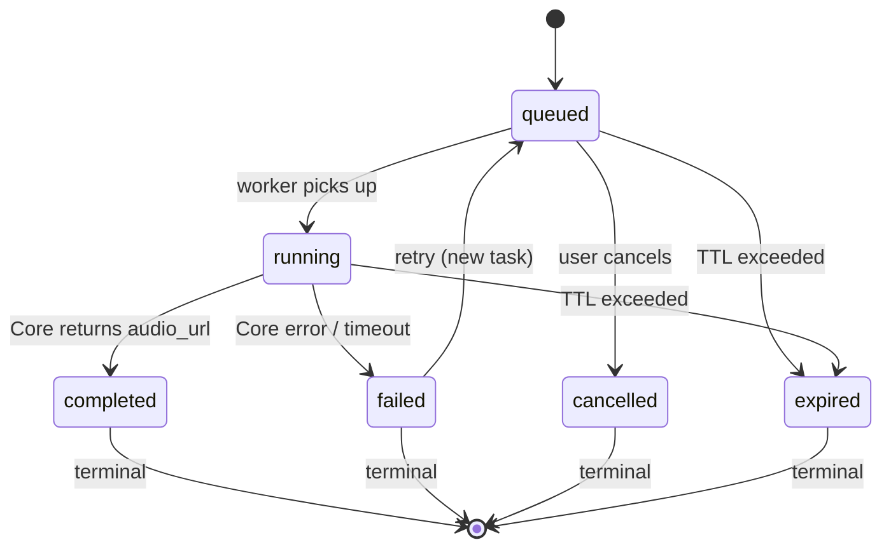

# P17 XiangTa TTS Task Orchestration Design C4

## 1. 阶段定位

当前 B9 已打通同步 TTS 链路：`POST /api/xiangta/tts` 同步等待 Core render 返回。

**C4 只做设计，不做实现。**

| 里程碑 | 说明 |
|---|---|
| B9 | 同步 TTS 链路打通 |
| C3 | Storage 设计（tts_tasks 表） |
| **C4** | **TTS Task Orchestration 设计（当前任务）** |
| C9 | Storage Foundation 实现 |
| C10 | TTS Task MVP 实现（in-memory queue + async API） |

**C4 不实现**：
- 不实现 queue
- 不实现 worker
- 不实现 SQLite task table
- 不修改现有 `/api/xiangta/tts` 行为

---

## 2. 当前同步链路问题

| # | 问题 | 影响 |
|---|---|---|
| 1 | H5 多次点击会重复请求 | 重复调用 Core render，浪费资源 |
| 2 | 同一用户多个浏览器可能同时生成 | 并发无控制 |
| 3 | 同步请求等待 Core render，移动端体验差 | HTTP 长连接，页面假死 |
| 4 | Core/Provider 慢响应占用 HTTP 连接 | 资源耗尽 |
| 5 | 失败后无可查询任务状态 | 用户不知道发生了什么 |
| 6 | 页面刷新后无法恢复任务 | 任务丢失 |
| 7 | 无幂等 key | 重复提交无法识别 |
| 8 | 无队列容量控制 | 无限堆积 |
| 9 | 无产品级并发限制 | 可能打爆 Core |
| 10 | 无统一 task 状态机 | 状态不一致 |

---

## 3. 分层并发模型

```
L0  Frontend Interaction Layer       — UX 防重复、轮询、状态展示
L1  API Admission Layer              — 输入校验、rate limit、idempotency、queue size
L2  TtsTaskService Orchestration    — 任务状态编排、生命周期管理
L3  Queue / Worker Layer            — 队列策略、worker 分发
L4  XiangTa → Core Gateway Layer    — Core HTTP 调用、超时、错误转换
L5  Voice Lab Core / Provider Layer — Core ResourceGuard、Provider 资源保护
L6  Storage / State Consistency     — tts_tasks 表、状态一致性
```

---

### 3.1 L0 Frontend Interaction Layer

**职责**：用户交互、状态展示、轮询

**解决的问题**：
- UX 防重复点击（按钮 disabled）
- 显示任务状态（queued/running/completed/failed）
- 轮询任务状态
- 刷新后通过 taskId 恢复查询

**不负责**：队列容量、并发限制

**MVP 策略**：
- 收到 `taskId` 后开始轮询 `GET /api/xiangta/tts/tasks/{taskId}`
- `pollAfterMs` 间隔（默认 1000ms，30s 后退避到 2000ms）
- 超过 `taskTtlSecs`（默认 1800s = 30min）停止轮询
- 失败文案：`生成失败，可重试`，提供重试按钮

**长期策略**：
- WebSocket 推送（可选，不在 C10 范围）
- 浏览器通知（可选）

**注意**：CA-06（H5 防重复点击）deferred to C8 或 dedicated H5 cleanup。

---

### 3.2 L1 API Admission Layer

**职责**：请求接入控制

**解决的问题**：
- 输入校验（text 长度、voicePreset 枚举校验）
- rate limit（全局 + per-user）
- idempotency key 检查
- queue size 检查
- 创建 task record

**不负责**：任务执行、Core 调用

**MVP 策略**：
```
非法输入 → HTTP 400，不创建 task
queue 已满 → HTTP 429
rate limited → HTTP 429
idempotency key 重复 → 返回已有 taskId（不重复创建）
```

**关键约束**：
- 队列满时不创建 task，用户收到明确错误
- 不在 API 层等待任务完成（异步）

---

### 3.3 L2 TtsTaskService Orchestration Layer

**职责**：任务生命周期编排

**解决的问题**：
- 统一的任务状态机
- 任务状态转换语义
- 过期任务清理

**不负责**：队列实现、Core 调用细节

**服务接口**：

```python
class TtsTaskService:
    async def create_task(...) -> TaskRecord: ...
    async def get_task(task_id: str) -> TaskRecord | None: ...
    async def cancel_task(task_id: str) -> bool: ...
    async def mark_running(task_id: str) -> bool: ...
    async def mark_completed(task_id: str, audio_url: str, duration_ms: int) -> bool: ...
    async def mark_failed(task_id: str, error_kind: str, error_message: str, retryable: bool) -> bool: ...
    async def mark_expired(task_id: str) -> bool: ...
    async def expire_old_tasks(ttl_secs: int) -> int: ...
```

**关键语义**：
- `mark_running` 只有在 `status='queued'` 时才更新，防止重复执行
- `mark_completed` / `mark_failed` 只有在 `status='running'` 时才更新
- 所有状态更新使用 `UPDATE ... WHERE status = ?` 原子操作

**与现有代码的关系**：
- 当前 `TtsOrchestrator.generate()` 直接调用 Core
- 未来 `TtsTaskService` 委托 `TtsOrchestrator` 执行具体 Core 调用
- `TtsOrchestrator` 不感知 queue 和 task 状态

---

### 3.4 L3 Queue / Worker Layer

**职责**：任务分发、并发控制

**解决的问题**：
- 任务排队
- 并发数量控制
- worker 分发

**Phase 1 — In-memory Queue（本地单用户 MVP）**：

```python
# asyncio.Queue + Semaphore
_queue: asyncio.Queue[TaskRecord] = asyncio.Queue(maxsize=10)
_semaphore: asyncio.Semaphore = asyncio.Semaphore(1)  # maxConcurrent

async def _worker():
    while True:
        task = await _queue.get()
        async with _semaphore:
            await _process_task(task)
        _queue.task_done()

# 限制：服务重启后 running/queued 状态不可恢复
# 页面刷新后可查询，但 worker 重启期间任务可能卡住
```

**Phase 2 — SQLite-backed Task Queue（C9 后实现）**：

```python
# tts_tasks 表 + polling worker
# worker 从 DB 拉取 status='queued' 的任务
# 状态可恢复，页面刷新后可查询
# 服务重启后可恢复 queued / expired
```

**Phase 3 — Redis / External Worker（多用户部署）**：

```python
# Redis queue + 独立 worker 进程
# 分布式锁保证不重复执行
# 多实例部署
```

**C4 只设计 Phase 1/2/3。C10 实现 Phase 1。**

---

### 3.5 L4 XiangTa → Core Gateway Layer

**职责**：Core HTTP 调用、超时、错误转换

**解决的问题**：
- Core 不可达时返回 `CoreRenderUnavailableError`
- Core 响应错误时返回 `CoreRenderResponseError`
- Core render 超时

**不负责**：用户级限流（这是 L1/L2 的职责）

**配置**：

```json
{
  "tts": {
    "coreRenderMaxConcurrent": 1
  },
  "core": {
    "timeoutSecs": 20
  }
}
```

**语义**：
- `coreRenderMaxConcurrent` 限制同时向 Core 发起的 render 请求数
- 这与 L2 的 `maxConcurrent` 独立：L2 的 `maxConcurrent` 是产品级用户并发，L4 的是 Core 调用层并发
- `coreTimeoutSecs` 是单个 Core render 的 HTTP 超时

**错误映射**（由 `error_translator.py` 处理）：

| Core 错误 | XiangTa 错误 | retryable |
|---|---|---|
| `CoreRenderUnavailableError` | `core_unavailable` | true |
| `CoreRenderResponseError` | `tts_failed` | true |
| HTTP 408/499 | `tts_timeout` | true |
| HTTP 429 | `provider_quota` | false |
| 其他 HTTP 4xx/5xx | `provider_error` | true |

---

### 3.6 L5 Voice Lab Core / Provider Layer

**职责**：Provider adapter、binding resolution、cost guard、resource guard、asset save

**XiangTa 不修改 Core**。XiangTa 通过 Core HTTP API 使用底座能力。

**Core ResourceGuard 职责**（XiangTa 不可见）：
- 单个 Provider 的并发限制
- Provider 额度保护
- Provider 级别 cost guard

**XiangTa TTS Task Queue 职责**：
- 产品级用户并发限制
- 任务状态管理
- 前端轮询

**两者不是替代关系，是不同层次的保护**。

```
XiangTa（L2/L4）限制进入 Core 的并发。
Core（L5）保护 Provider adapter 的实际调用。
Provider 仍可能独立限流或额度不足。
```

---

### 3.7 L6 Storage / State Consistency Layer

**职责**：tts_tasks 表持久化、状态一致性

**C3 tts_tasks 表字段**：

```sql
task_id, user_id, status, text, recipient, scene,
voice_preset, profile_id, tone, audio_url, duration_ms,
error_kind, error_message, retryable, request_id,
created_at, started_at, completed_at, failed_at,
cancelled_at, expired_at, updated_at
```

**状态更新原子性**：

```sql
-- mark_running 只有在 queued 时才成功
UPDATE tts_tasks
SET status = 'running', started_at = ?, updated_at = ?
WHERE task_id = ? AND status = 'queued';

-- 检查 affected_rows = 1 才算成功，否则说明已被其他 worker 处理
```

**SQLite 单进程保证**：SQLite 写操作有内锁，单进程 worker 不需要分布式锁。

**多 worker 时**：需要乐观锁（version 字段）或 `FOR UPDATE`（如 SQLite 支持）。

---

## 4. API 合约设计

### 4.1 创建 TTS Task

```
POST /api/xiangta/tts/tasks
```

**请求体**：

```json
{
  "text": "我想你了，但不知道怎么说。",
  "recipient": "lover",
  "scene": "miss",
  "voicePreset": "night-male",
  "tone": "gentle",
  "profileId": null,
  "clientRequestId": "client-uuid-optional"
}
```

**字段说明**：

| 字段 | 必填 | 说明 |
|---|---|---|
| `text` | ✅ | 1-500 字符 |
| `recipient` | ✅ | `lover` / `family` / `friend` / `self` |
| `scene` | ✅ | `miss` / `sorry` / `thanks` / `comfort` / `night` |
| `voicePreset` | ✅ | voicePreset ID（如 `female-gentle`） |
| `tone` | ✅ | `gentle` / `restrained` / `sincere` / `whisper` / `bedtime` |
| `profileId` | ❌ | B9 临时路径，正式产品应使用 `voicePreset` 映射 |
| `clientRequestId` | ❌ | 幂等 key，用于防止重复提交 |

**响应（queued）**：

```json
{
  "ok": true,
  "data": {
    "taskId": "T_abc12345",
    "status": "queued",
    "pollAfterMs": 1000,
    "message": "已加入生成队列"
  }
}
```

**错误响应**：

| 情况 | HTTP | ok | errorKind |
|---|---|---|---|
| text 为空/超长 | 400 | false | `validation_error` |
| queue 已满 | 429 | false | `queue_full` |
| rate limited | 429 | false | `rate_limited` |
| voicePreset 不存在 | 400 | false | `validation_error` |

---

### 4.2 查询 TTS Task

```
GET /api/xiangta/tts/tasks/{taskId}
```

**queued 响应**：

```json
{
  "ok": true,
  "data": {
    "taskId": "T_abc12345",
    "status": "queued",
    "audioUrl": null,
    "durationMs": null,
    "errorKind": null,
    "message": "排队中…",
    "retryable": false,
    "pollAfterMs": 1000,
    "createdAt": "2026-05-18T00:00:00Z",
    "updatedAt": "2026-05-18T00:00:00Z"
  }
}
```

**running 响应**：

```json
{
  "ok": true,
  "data": {
    "taskId": "T_abc12345",
    "status": "running",
    "audioUrl": null,
    "durationMs": null,
    "errorKind": null,
    "message": "正在生成声音…",
    "retryable": false,
    "pollAfterMs": 1000,
    "createdAt": "2026-05-18T00:00:00Z",
    "updatedAt": "2026-05-18T00:00:01Z"
  }
}
```

**completed 响应**：

```json
{
  "ok": true,
  "data": {
    "taskId": "T_abc12345",
    "status": "completed",
    "audioUrl": "http://127.0.0.1:8000/api/voice/assets/xxx/download",
    "durationMs": 8200,
    "errorKind": null,
    "message": null,
    "retryable": false,
    "pollAfterMs": null,
    "createdAt": "2026-05-18T00:00:00Z",
    "updatedAt": "2026-05-18T00:00:08Z"
  }
}
```

**failed 响应**：

```json
{
  "ok": true,
  "data": {
    "taskId": "T_abc12345",
    "status": "failed",
    "audioUrl": null,
    "durationMs": null,
    "errorKind": "provider_quota",
    "message": "语音生成额度暂时不可用，请稍后再试。",
    "retryable": true,
    "pollAfterMs": null,
    "createdAt": "2026-05-18T00:00:00Z",
    "updatedAt": "2026-05-18T00:00:05Z"
  }
}
```

**关键语义**：GET task 成功但任务失败时 `ok=true`，`status=failed`。只有 task 不存在/无权限/参数非法时 `ok=false`。

---

### 4.3 取消 TTS Task（可选，MVP 可不实现）

```
POST /api/xiangta/tts/tasks/{taskId}/cancel
```

**MVP 策略**：

| 当前状态 | 是否可取消 | 说明 |
|---|---|---|
| `queued` | ✅ | 直接标记 cancelled，worker 不会再处理 |
| `running` | ❌ | Core render 已开始，无法保证取消 |
| `completed` | ❌ | 已完成 |
| `failed` | ❌ | 已失败 |
| `expired` | ❌ | 已过期 |

**C10 MVP 可不实现 cancel 接口**。C4 只保留合约设计。

---

### 4.4 现有同步接口兼容

当前已有：

```
POST /api/xiangta/tts
```

**三种策略比较**：

| 策略 | 说明 | 结论 |
|---|---|---|
| A. `/tts` 继续同步 | 不变 | 不解决任何并发问题 |
| B. `/tts` 内部创建 task 并等待 | 兼容但复杂 | 引入 task 到同步路径 |
| C. `/tts` 保留为 smoke/debug path | 解耦简单路径和产品路径 | **推荐** |

**推荐策略 C**：`/tts` 保留为 B9 smoke / debug 路径；`/tts/tasks` 作为产品主路径。

```
POST /api/xiangta/tts        → B9 smoke / debug only（保留）
POST /api/xiangta/tts/tasks  → 产品主路径（新建）
GET  /api/xiangta/tts/tasks/{id} → 产品查询（新建）
```

未来 H5 迁移到 `/tts/tasks` 后，`/tts` 可标记 deprecated。

---

## 5. 状态机设计

### 状态定义

```
queued    — 任务已创建，等待 worker 拉取
running   — worker 正在调用 Core render
completed — Core render 成功，audioUrl 已返回
failed   — Core render 失败或超时
cancelled — 用户主动取消（queued 状态时）
expired   — 任务超过 TTL 未完成
```

### 状态转换图



### 允许的转换

| 当前状态 | 可转换到 | 触发条件 |
|---|---|---|
| `queued` | `running` | worker 拉取并开始执行 |
| `queued` | `cancelled` | 用户取消 |
| `queued` | `expired` | TTL 超过 |
| `running` | `completed` | Core render 成功 |
| `running` | `failed` | Core error / timeout |
| `running` | `expired` | TTL 超过 |
| `failed` | `queued` | 重试（创建新 task） |

### 禁止的转换

```
completed → running      ❌
completed → failed       ❌
failed → completed      ❌
cancelled → running     ❌
expired → running       ❌
任何状态 → queued（重试是新建 task）❌
```

### 重试语义

重试**不复用旧 task**，而是**创建新 task**。

旧 task 的 `failed` 状态保留审计轨迹。

未来可扩展字段 `retry_of_task_id`（不在 MVP 范围）。

---

## 6. 幂等设计

### clientRequestId

**来源**：请求体中 `clientRequestId` 字段

**存储**：`tts_tasks.request_id` 字段

**规则**：

```
同一 user_id + clientRequestId 的已有 task：
  queued/running → 返回已有 taskId（不重复创建）
  completed → 返回已有 taskId（已完成，结果不变）
  failed → 返回已有 taskId（不重复创建）
  cancelled → 返回已有 taskId（已取消）
  不存在 → 创建新 task
```

**无 user_id 时的策略**：

当前无用户系统，`user_id = "local"` 或 `NULL`。

**C10 实现时**：

```python
# TtsTaskService.create_task 伪代码
existing = await task_repo.find_by_request_id(user_id, client_request_id)
if existing:
    return existing
new_task = await task_repo.create(...)
return new_task
```

---

## 7. 并发限制策略

### 7.1 全局限制

```json
{
  "tts": {
    "globalRunningLimit": 1,
    "globalQueueLimit": 10
  }
}
```

| 参数 | 默认值 | 说明 |
|---|---|---|
| `globalRunningLimit` | 1 | 全局同时 running 任务数 |
| `globalQueueLimit` | 10 | 全局最大队列长度 |

### 7.2 用户限制

```json
{
  "tts": {
    "perUserRunningLimit": 1,
    "perUserQueuedLimit": 5
  }
}
```

| 参数 | 默认值 | 说明 |
|---|---|---|
| `perUserRunningLimit` | 1 | 单用户同时 running 任务数 |
| `perUserQueuedLimit` | 5 | 单用户最大排队任务数 |

当前无用户系统：`user_id = "local"`。

### 7.3 Core Render 限制

```json
{
  "tts": {
    "coreRenderMaxConcurrent": 1
  }
}
```

限制同时向 Core 发起的 render 并发数。

### 7.4 限制层级关系

```
L1 API Admission     — perUserRunningLimit / perUserQueuedLimit
L2 TtsTaskService   — globalRunningLimit / globalQueueLimit
L4 Core Gateway     — coreRenderMaxConcurrent
```

三层限制各自独立，叠加生效。

---

## 8. Runtime Config 扩展设计

C2 已实现基础 runtime config。C4 扩展 `tts` section：

```json
{
  "tts": {
    "mode": "sync",
    "queueEnabled": false,
    "maxConcurrent": 1,
    "maxQueueSize": 10,
    "taskTtlSecs": 1800,
    "pollAfterMs": 1000,
    "idempotencyEnabled": true,
    "perUserRunningLimit": 1,
    "perUserQueuedLimit": 5,
    "coreRenderMaxConcurrent": 1
  }
}
```

| 字段 | 类型 | 默认值 | 说明 |
|---|---|---|---|
| `mode` | str | `sync` | `sync` / `async` |
| `queueEnabled` | bool | false | 是否启用 async queue |
| `maxConcurrent` | int | 1 | 全局 running 并发上限 |
| `maxQueueSize` | int | 10 | 全局队列上限 |
| `taskTtlSecs` | int | 1800 | 任务 TTL（30分钟） |
| `pollAfterMs` | int | 1000 | 前端默认轮询间隔 |
| `idempotencyEnabled` | bool | true | 是否启用 clientRequestId 幂等 |
| `perUserRunningLimit` | int | 1 | 单用户 running 上限 |
| `perUserQueuedLimit` | int | 5 | 单用户队列上限 |
| `coreRenderMaxConcurrent` | int | 1 | Core render 并发上限 |

**C4 只设计，不修改 runtime.json。C10 实现时再扩展配置。**

---

## 9. 错误与重试策略

### 9.1 API 层错误（不创建 task）

| 错误 | HTTP | errorKind | 说明 |
|---|---|---|---|
| text 为空 | 400 | `validation_error` | 不创建 task |
| text 超长 | 400 | `text_too_long` | 不创建 task |
| voicePreset 不存在 | 400 | `validation_error` | 不创建 task |
| queue 已满 | 429 | `queue_full` | 不创建 task |
| rate limited | 429 | `rate_limited` | 不创建 task |

### 9.2 Task 层错误（创建 task 后失败）

| 错误 | task status | errorKind | retryable | 说明 |
|---|---|---|---|---|
| Core 不可达 | `failed` | `core_unavailable` | true | |
| Core render response error | `failed` | `tts_failed` | true | |
| Core render timeout | `failed` | `tts_timeout` | true | |
| Provider quota exhausted | `failed` | `provider_quota` | false | |
| 其他 Provider 错误 | `failed` | `provider_error` | true | |
| 未知错误 | `failed` | `unknown` | true | |

### 9.3 重试策略

**MVP 不自动重试**。用户手动重试。

```
failed task → 用户重新 POST /tts/tasks → 新建 task
```

未来扩展（不在 C10 范围）：
```
failed task.retryable=true → 可选自动重试
maxRetryCount: 2
retryOfTaskId: <原始task_id>
```

---

## 10. 前端轮询策略

### 轮询参数

| 参数 | 默认值 | 说明 |
|---|---|---|
| `pollAfterMs` | 1000 | 初始轮询间隔 |
| `pollBackoffAfterSecs` | 30 | 30秒后轮询间隔退避到 2000ms |
| `taskTtlSecs` | 1800 | 超过 30 分钟停止轮询 |

### 状态文案

| status | H5 显示文案 |
|---|---|
| `queued` | 排队中… |
| `running` | 正在生成声音… |
| `completed` | 生成完成 |
| `failed` | 生成失败，可重试 |
| `cancelled` | 已取消 |
| `expired` | 任务已过期 |

### 轮询流程

```
POST /tts/tasks → 收到 taskId, status=queued
  ↓
GET /tts/tasks/{taskId} 轮询
  ↓
pollAfterMs = 1000
  ↓
30秒后 pollAfterMs = 2000
  ↓
超过 taskTtlSecs（30分钟）→ 停止轮询，显示 expired
  ↓
completed → 显示 audio player
failed → 显示重试按钮
```

### 刷新恢复

页面刷新后，通过本地存储（或 URL query param）保存 `taskId`，从 `taskId` 恢复轮询。

---

## 11. 与 C3 tts_tasks 表对齐

C4 API 与 C3 `tts_tasks` 表字段一致：

| API 字段 | tts_tasks 列 | 说明 |
|---|---|---|
| `taskId` | `task_id` | |
| `status` | `status` | |
| `audioUrl` | `audio_url` | Core 返回（B9-FIX3 绝对 URL） |
| `durationMs` | `duration_ms` | |
| `errorKind` | `error_kind` | |
| `errorMessage` | `error_message` | 用户可理解文案 |
| `retryable` | `retryable` | |
| `clientRequestId` | `request_id` | 幂等 key |
| `createdAt` | `created_at` | |
| `updatedAt` | `updated_at` | |
| `startedAt` | `started_at` | |
| `completedAt` | `completed_at` | |
| `failedAt` | `failed_at` | |
| `cancelledAt` | `cancelled_at` | |
| `expiredAt` | `expired_at` | |

**C3 字段调整建议**：无。C3 tts_tasks 表设计完整覆盖 C4 需要。

---

## 12. 与 Core ResourceGuard 边界

```
XiangTa TtsTaskService（L2）    — 产品任务并发、用户级限制
XiangTa Core Gateway（L4）      — Core HTTP 调用、coreRenderMaxConcurrent
Voice Lab Core ResourceGuard（L5）— Provider adapter 并发、cost guard
Provider                          — 外部 API rate limit / quota
```

**各自职责独立，不是替代关系。**

```
XiangTa 限制进入 Core 的产品级并发（maxConcurrent=1）。
Core 限制 Provider adapter 的实际调用（ResourceGuard）。
Provider 有自己的 quota 和 rate limit。
```

---

## 13. 实现阶段拆分

| 阶段 | 任务 | 类型 |
|---|---|---|
| C4 | TTS Task Orchestration Design | **Design（当前）** |
| C5 | LLM Copywriting Design | Design |
| C6 | Error Contract Design | Design |
| C7 | Profile Mapping Design | Design |
| C8 | H5 Design Alignment | Design |
| C9 | Storage Foundation | Implementation |
| C10 | TTS Task MVP | Implementation |
| C10-1 | task API schemas + routes | Implementation |
| C10-2 | TtsTaskService | Implementation |
| C10-3 | in-memory worker loop | Implementation |
| C10-4 | SQLite-backed task persistence | Implementation |
| C10-5 | H5 polling + retry UX | Implementation |

**C4 完成后建议**：

```
不要立即实现 C10。
建议先完成 C5/C6/C7 设计，
因为 Task 实现依赖 Storage Foundation（C9）、Error Contract（C6）、Profile Mapping（C7）和 H5 API contract（C8）。
```

---

## 14. 测试设计建议

C10 实现时需要覆盖的测试点：

### API 层

| 测试点 | 期望 |
|---|---|
| POST /tts/tasks 创建 queued task | taskId + status=queued |
| GET /tts/tasks/{id} 查询 queued | status=running |
| clientRequestId 重复提交 | 返回已有 taskId，不重复创建 |
| queue 已满提交 | HTTP 429 + queue_full |
| text 超长提交 | HTTP 400 + validation_error |
| voicePreset 不存在 | HTTP 400 + validation_error |

### Worker 层

| 测试点 | 期望 |
|---|---|
| worker 拉取 queued → running | 状态转换正确 |
| Core 返回成功 → completed | audioUrl 填充 |
| Core unavailable → failed | errorKind=core_unavailable, retryable=true |
| Core timeout → failed | errorKind=tts_timeout |
| queue 满时新任务拒绝 | HTTP 429 |

### 幂等

| 测试点 | 期望 |
|---|---|
| 同一 clientRequestId 两次 POST | 第二次返回已有 taskId |
| 不同 user_id 同一 clientRequestId | 创建两个 task |

### 并发限制

| 测试点 | 期望 |
|---|---|
| 全局 maxConcurrent=1，两任务同时 running | 第二个排队或拒绝 |
| perUserQueuedLimit=5，超过后拒绝 | HTTP 429 |

### 状态机

| 测试点 | 期望 |
|---|---|
| queued → running 合法转换 | 成功 |
| completed → running 禁止转换 | 不更新 |
| expired 状态正确 | 超 TTL 自动标记 |

---

## 15. 交叉引用

- **C1 Backend Capability Plan**：定义了 task queue 需求和 Phase 1/2/3 策略
- **C3 Storage Design**：tts_tasks 表设计为此 C4 的存储基础
- **C2 Runtime Config**：tts section 扩展为此 C4 的配置基础
- **C10 TTS Task MVP**：实现此 C4 设计
- **CA-06**：H5 防重复点击 deferred to C8
- **GAP-B2-001**：voicePreset mapping deferred to C7

---

## 16. 关键设计决策总结

| 决策 | 选择 | 原因 |
|---|---|---|
| 产品 API 路径 | `/tts/tasks`（异步） | 解耦 smoke 路径和产品路径 |
| 保留 `/tts` | 作为 smoke/debug 路径 | B9 验证需要 |
| 队列 Phase 1 | in-memory asyncio.Queue | 单用户 MVP，零依赖 |
| 重试策略 | MVP 不自动重试，用户手动重试 | 简化实现，避免幂等复杂化 |
| 取消语义 | queued 可取消，running 不保证 | Core render 不可中断 |
| 幂等 key | clientRequestId + user_id | 防止重复提交 |
| 状态机 | 6 状态 + 禁止转换表 | 清晰、不可达状态不出错 |
